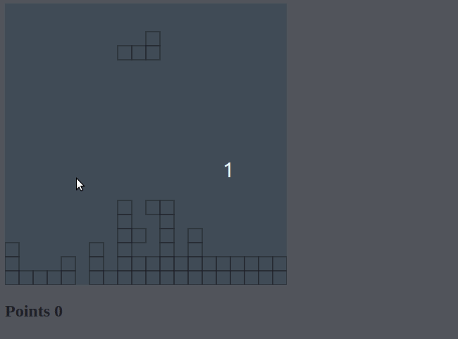

# Tetris using HTML, CSS, JS

## Controls

- Arrow up to rotate shape 90 degrees clockwise
- Arrow left to move shape left
- Arrow right to move shape right

_coming soon_

- Arrow down so shape falls falls faster
- More shapes!
